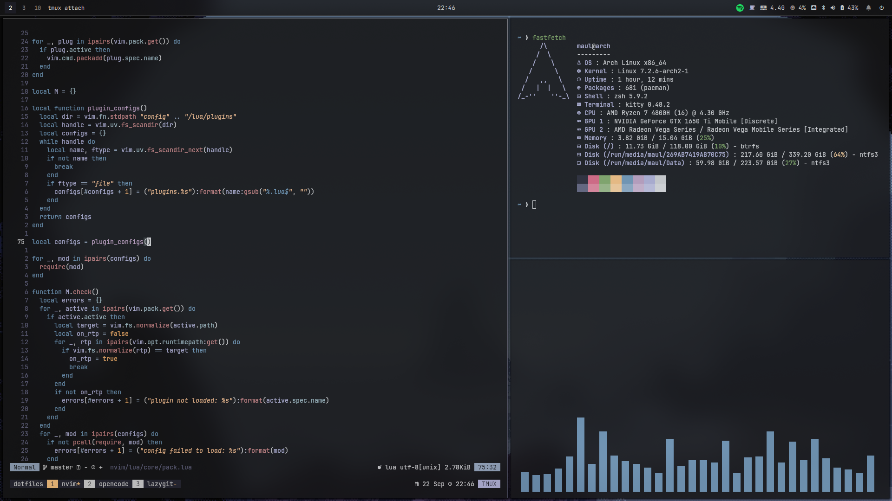

# dotfiles

Minimal Hyprland desktop config, managed with plain symlinks.



## Setup

```sh
git clone https://github.com/bymaul/dotfiles ~/dotfiles
# install requirements (below), then:
~/dotfiles/install.sh
```

The script is idempotent - safe to re-run at any time. Each app is a flat
package dir whose contents mirror its real location in `$HOME`
(e.g. `waybar/` -> `~/.config/waybar`, `zsh/.zshenv` -> `~/.zshenv`).
Dedicated app dirs are folded into a single symlink
(`~/.config/nvim -> ~/dotfiles/nvim`), so new files show up automatically.
Shared targets (`~`, `~/.config` root, `~/.local/bin`) get their entries
linked individually; re-run `./install.sh` after adding new top-level files
to those packages. Unmanaged dirs like `dconf`/`mozilla` are left alone.

## Requirements

- **Hyprland** >= 0.56 (Lua config), **waybar**, **mako**, **rofi**, **kitty**, **nemo**
- **wleave** (build from source), **swaybg** (wallpaper, `pacman -S swaybg`)
- **nvim**, **tmux**, **zsh**, **starship**, **lazygit**, **yazi**, **eza**, **bat**, **fd**, **btop**
- **pay-respects** (fixes typos: press F or type `f`; AUR `pay-respects`)
- **pipewire**, **brightnessctl**, **libnotify**, **wl-clipboard**, **grim**, **slurp**, **cliphist**, **playerctl**, **jq**, **polkit-kde-agent**
- **Nerd Font**

## Two-repo sync

Shared configs (`nvim`, `starship`, `bat`, `lazygit`, `opencode`, `zsh`, `tmux`,
`fastfetch`)
are mirrored into [`bymaul/winfiles`](https://github.com/bymaul/winfiles)
(Windows + WSL) via `.github/workflows/sync.yml`. A push touching a shared
package opens a sync PR in the other repo (auto-merged if clean, manual if
conflicted). Set a PAT (`repo` scope) as the `GH_TOKEN` secret in both repos.
