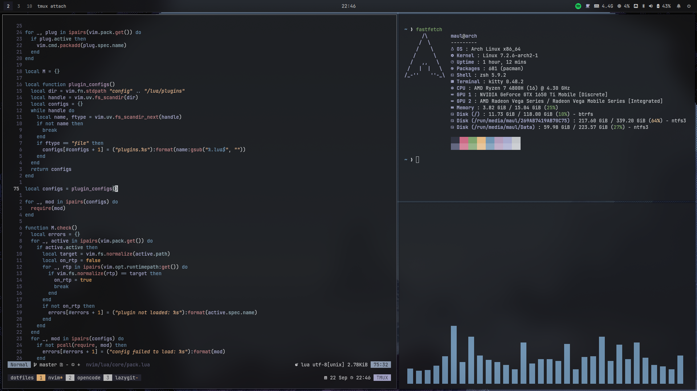

# dotfiles

Minimal Hyprland desktop config, managed with plain symlinks.



## Setup

```sh
git clone https://github.com/bymaul/dotfiles ~/dotfiles
cd ~/dotfiles
sudo pacman -S --needed - < pkglist.txt
./install.sh
```

- Each app dir mirrors its location in `$HOME` and is linked in (`~/.config/nvim -> ~/dotfiles/nvim`); new files inside show up automatically.
- Shared targets (`~`, `~/.config`, `~/.local/bin`) link per-file - re-run `./install.sh` after adding top-level files there.
- Idempotent and safe to re-run; `./install.sh --remove [packages...]` unlinks again. Anything unmanaged is never touched unless you pass `--backup` (moves it to `~/.local/share/dotfiles-backup/<date>/`). Preview with `./install.sh --dry-run`, check with `./install.sh --verify`.
- After cloning: `mise trust && mise install`.

## Requirements

See `pkglist.txt` (official repos, including `quickshell`).

Plus a **Nerd Font**, and **starship** (installed via `zinit` from GitHub releases on first `zsh` run). power-profiles-daemon is optional - only for power-profile switching.

## Power management

Idle dim/lock/DPMS/suspend is owned by quickshell (Settings popup, System tab writes `hypridle.conf`). The power button always suspends (quickshell locks, then suspends). Lid close goes through systemd-logind:

Idle dim hits both monitors: internal panel via `brightnessctl`, external via `hyprsunset` gamma (restores with `gamma 100` since `identity` is a no-op in hyprsunset 0.4.0). DPMS uses `hyprctl eval 'hl.dispatch(hl.dsp.dpms(...))'` - the old `hyprctl dispatch dpms` syntax broke in Hyprland 0.55+.

Control panel tiles include Caffeine (systemd idle inhibitor), DND, and Bluelight (`hyprsunset` 4000K on / 6000K off). Brightness slider goes down to 0% (`Theme.brightnessMin`).

```sh
qs-power-logind --apply
```

Reboot afterwards - logind only reads the drop-in at startup.

## ASUS laptops (optional)

On ASUS ROG/TUF machines, quickshell picks up `asusctl` when present (no service to enable - `asusd` starts via udev; keep `power-profiles-daemon` running):

```sh
sudo pacman -S asusctl
```

This switches the control-panel profile tile and the System tab `Active profile` row to the vendor `Quiet / Balanced / Performance` profiles, and adds a `Charge limit` row on top of the Battery section. Without it everything falls back to PPD, so non-ASUS machines need nothing.

## Two-repo sync

Shared configs (`nvim`, `starship`, `bat`, `lazygit`, `agents`, `zsh`, `tmux`, `fastfetch`, `git`) mirror into [`bymaul/winfiles`](https://github.com/bymaul/winfiles) via a sync workflow; pushes touching them open an auto-merged PR there. Needs a `repo`-scoped PAT as `GH_TOKEN` in both repos.
